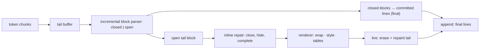

# markdrip

[English](README.md) | [中文](README.zh.md) | [日本語](README.ja.md)

[](LICENSE)   [](CONTRIBUTING.md)

**markdrip はターミナル向けストリーミング markdown レンダラー。トークン単位の出力のために作られ、不完全な markdown をストリーム中に修復し——閉じていない強調、打ちかけのリンク、開いたままのコードフェンス——完成したブロックを二度と再描画されない安定行としてコミットする。依存ゼロ。**


```bash
# not yet on npm — install from a checkout of this repository
npm install && npm run build && npm pack
npm install -g ./markdrip-0.1.0.tgz
```

## なぜ markdrip？

どの AI CLI も同じ壁にぶつかる。モデルは markdown を数文字ずつ出力するのに、優れたレンダラー——glow、glamour、rich——はどれも完成文書用だ。完全なファイルを要求するため、各ツールはストリームが終わるまで生の `**アスタリスク**` を垂れ流すか、トークンごとにバッファ全体を再レンダリングするか（ちらつき、二乗オーダーの再描画、スクロールバック破壊）、壊れやすい「閉じフェンス待ち」ステートマシンを自作するかになる。markdrip はその欠けていた中間層だ。増分ブロックパーサーが各ブロックに *closed*（もう変化しない）か *open*（まだ成長中）の印を付け、closed ブロックは最終行としてちょうど一度だけコミットされ、唯一の open な末尾はインライン**修復パス**を通る——`**bold` は閉じ記号が届く前に太字で描画され、`[label](partial-url` はラベルに装飾を付けて URL を隠し、閉じていないフェンスもコードとして描画され、*たった今*打たれた記号は生のまま点滅せず隠される。エンジンの契約はテストで強制される。どんな文書のどんな分割でもワンショット描画とバイト単位で一致し、コミット済みの行は決して変化しない——だから append モードは安心してログへ `tee` でき、live モードは TTY 上で open な末尾だけを再描画する。

|  | markdrip | glow | glamour | rich (Python) | marked-terminal |
|---|---|---|---|---|---|
| 入力モデル | 増分チャンク、任意の分割 | 文書全体 | 文書全体 | 文書全体 | 文書全体 |
| 不完全な markdown | ストリーム中に修復、EOF で確定 | 非対応 | 非対応 | 非対応 | 非対応 |
| 安定した部分出力 | closed ブロックは一度だけコミット、再描画なし | 非対応 | 非対応 | 非対応 | 非対応 |
| ストリーミングのコードフェンス | 開いたまま行単位でコミット | 非対応 | 非対応 | 非対応 | 非対応 |
| ランタイム依存 | 0 | Go モジュールツリー | Go モジュールツリー | Python パッケージツリー | 直接 4 + 推移的依存 |
| パイプ安全性 | append モード：プレーン、最終行のみ | ANSI ページャ UI | ライブラリ | ライブラリ | ライブラリ |

<sub>機能・依存の記述は各プロジェクトの公開リポジトリで確認、2026-07。</sub>

## 特徴

- **トークン単位の入力、任意の分割** — 1 文字ずつでも文書丸ごとでも、最終出力はバイト単位で同一（複数フィクスチャで性質テスト済み）。
- **ストリーム中の修復** — 閉じていない `**`/`*`/`~~`/`` ` `` は投機的に装飾付きで描画、未完のリンクはラベルに装飾を付けて生 URL を抑制、打たれた直後の記号は隠されるので何も点滅しない。`end()` は宙ぶらりんの記号を厳密な CommonMark リテラル意味論で確定する。
- **コミット/揮発の契約** — 完成ブロックは安定行としてちょうど一度だけ出力（パイプ、`tee`、スクロールバックに安全）。再描画されるのは唯一の open な末尾ブロックだけ。
- **コードフェンスは行単位でストリーム** — 改行で終わったコード行は即コミットされ、長いストリーミングコードブロックでも再描画は未完の 1 行だけ。
- **実用的なブロック網羅** — ATX + setext 見出し、ハードブレイク付き段落、ネスト/タスクリスト、遅延継続付き引用、バッククォート/チルダフェンス、整列付きパイプテーブル、水平線。
- **ターミナル準拠のレイアウト** — CJK/絵文字/書記素の幅を考慮した折り返し、ぶら下げインデント、整列テーブル。装飾断片はそれぞれ SGR を自分で開閉するので、行の切断や並べ替えにも耐える。
- **依存ゼロ、完全オフライン** — 必要なのは Node.js だけ。devDependency は `typescript` のみ。ネットワークなし、テレメトリなし。

## クイックスタート

インストール：

```bash
# not yet on npm — install from a checkout of this repository
npm install && npm run build && npm pack
npm install -g ./markdrip-0.1.0.tgz
```

markdown を出力する任意のコマンドをパイプでつなぐ——届いたそばから整形される：

```bash
printf '# Deploy report\n\nAll **12 checks** passed in `4.2s` — see [the log](https://example.test/log).\n\n- [x] build\n- [ ] publish\n' | markdrip --width 60
```

出力（実際にキャプチャした実行結果。`--color` を付けると TTY での装飾が見える）：

```text
# Deploy report

All 12 checks passed in 4.2s — see the log.

✔ build
☐ publish
```

API も同じエンジン——チャンクが届いたら `push()`、コミット済みの行は不変：

```js
import { StreamRenderer, render } from "markdrip";

const r = new StreamRenderer({ width: 72, mode: "append" });
for await (const token of modelStream) {
  process.stdout.write(r.push(token)); // only newly-final lines
}
process.stdout.write(r.end());         // finalize the open tail

render("# one-shot\n\nFor complete documents.\n"); // classic mode
```

## CLI リファレンス

| コマンド | 動作 | 主なフラグ |
|---|---|---|
| `markdrip` | stdin をストリームしながら描画 | `--live`、`--plain`、`--width` |
| `markdrip <file>` | ファイルをワンショット描画 | `--width`、`--no-color` |
| `markdrip -` | stdin を明示的に読む | stdin モードと同じ |

TTY では open な末尾がその場で再描画され（`--live`）、パイプ経由ではコミット済みの行だけが書かれる（`--plain`）ので、`markdrip | tee log` はきれいな記録を残す。終了コード：0 成功、1 入力ファイル読取不能、2 用法エラー。`NO_COLOR` に対応。

## オプション

| キー | 既定値 | 効果 |
|---|---|---|
| `width` | `80`（CLI は TTY で端末幅、上限 100） | 本文の折り返し幅。コード行は折り返さない |
| `color` | TTY でオン、パイプでオフ | ANSI 装飾を出力 |
| `mode` | `append`（API）、CLI は自動 | `append`：コミット行のみ · `live`：末尾を再描画 |
| `hyperlinks` | `false` | リンクラベルを OSC 8 エスケープで包む |
| `showUrls` | `false` | 各リンクの後に淡色でリンク先を付記 |
| `theme` | 組み込み | 任意の SGR ロールを上書き（見出し、ガター、ビュレット等） |

コミット規則、修復ポリシー表、強制される 4 つの不変条件の全文は [docs/streaming-model.md](docs/streaming-model.md) に。低レベル API（`parseBlocks`、`parseInline`、`repairInline`、`wrapSpans`）はエクスポート済みで、生成される型宣言に文書化されている。

## アーキテクチャ



## ロードマップ

- [x] closed/open 契約付き増分ブロックパーサー、インライン修復パス、その場再描画付きコミット/揮発ストリーミングエンジン、フルブロック網羅（見出し、リスト、引用、フェンス、テーブル、水平線）、幅考慮の折り返し、CLI — 90 テスト + `scripts/smoke.sh`（v0.1.0）
- [ ] フェンス内シンタックスハイライト（プラガブル、既定は依存ゼロのまま）
- [ ] インデントコードブロックと HTML ブロックのパススルー
- [ ] live モードでの端末リサイズ時の幅再交渉
- [ ] ストリーミング対応のテーブルレイアウト（漸進的な列幅）

全リストは [open issues](https://github.com/JaydenCJ/markdrip/issues) を参照。

## コントリビュート

コントリビュート歓迎。`npm install && npm run build` でビルドし、`npm test`（90 テスト）と `bash scripts/smoke.sh`（`SMOKE OK` を印字すること）を実行——このリポジトリは CI を持たず、上記の主張はすべてローカル実行で検証される。[CONTRIBUTING.md](CONTRIBUTING.md) を読み、[good first issue](https://github.com/JaydenCJ/markdrip/issues?q=is%3Aissue+is%3Aopen+label%3A%22good+first+issue%22) を選ぶか、[discussion](https://github.com/JaydenCJ/markdrip/discussions) を始めてほしい。

## ライセンス

[MIT](LICENSE)
