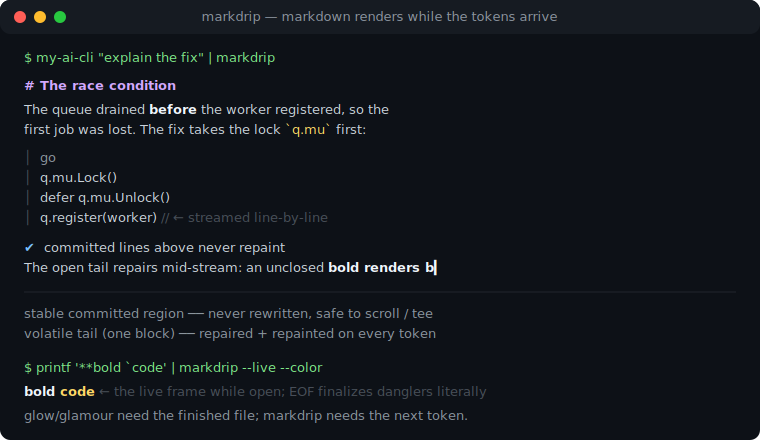
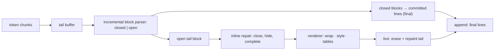

# markdrip

[English](README.md) | [中文](README.zh.md) | [日本語](README.ja.md)

[](LICENSE)   [](CONTRIBUTING.md)

**markdrip is a streaming markdown renderer for terminals, built for token-by-token output: it repairs incomplete markdown mid-stream — unclosed emphasis, half-typed links, open code fences — and commits finished blocks as stable lines that are never repainted. Zero dependencies.**



```bash
# not yet on npm — install from a checkout of this repository
npm install && npm run build && npm pack
npm install -g ./markdrip-0.1.0.tgz
```

## Why markdrip?

Every AI CLI hits the same wall: the model emits markdown a few characters at a time, but the good renderers — glow, glamour, rich — are document renderers. They need the finished file, so tools either dump raw `**asterisks**` until the stream ends, re-render the whole buffer on every token (flicker, quadratic repaints, scrollback destroyed), or hand-roll a fragile "wait for the closing fence" state machine. markdrip is the missing middle layer: an incremental block parser tags each block *closed* (can never change again) or *open* (still growing), closed blocks commit exactly once as final lines, and the single open tail is run through an inline **repair pass** — `**bold` renders bold before its closer arrives, `[label](partial-url` styles the label and hides the URL, a fence that hasn't closed still renders as code, and a marker that was *just* typed is hidden instead of flashing raw. The engine's contract is enforced by tests: any chunking of any document is byte-identical to the one-shot render, and a committed line never mutates — so the append mode is safe to `tee` into a log while the live mode repaints only the open tail on a TTY.

|  | markdrip | glow | glamour | rich (Python) | marked-terminal |
|---|---|---|---|---|---|
| Input model | incremental chunks, any split | whole document | whole document | whole document | whole document |
| Incomplete markdown | repaired mid-stream, finalized at EOF | n/a | n/a | n/a | n/a |
| Stable partial output | closed blocks commit once, never repaint | n/a | n/a | n/a | n/a |
| Streaming code fences | commits line-by-line while open | n/a | n/a | n/a | n/a |
| Runtime dependencies | 0 | Go module tree | Go module tree | Python package tree | 4 direct + transitive |
| Pipe safety | append mode: plain, final lines only | ANSI pager UI | library | library | library |

<sub>Capability and dependency claims checked against each project's public repository, 2026-07.</sub>

## Features

- **Token-by-token input, any chunking** — feed single characters or whole documents; the final output is byte-identical either way (property-tested across fixtures).
- **Mid-stream repair** — unclosed `**`/`*`/`~~`/`` ` `` render styled speculatively, pending links style their label and suppress the raw URL, just-typed markers are hidden so nothing flashes; `end()` finalizes danglers with strict CommonMark-literal semantics.
- **Commit/volatile contract** — finished blocks emit exactly once as stable lines (safe for pipes, `tee`, scrollback); only the one open tail block ever repaints.
- **Code fences stream line-by-line** — each terminated code line commits immediately, so a long streaming code block repaints one partial line, not the whole block.
- **Real block coverage** — ATX + setext headings, paragraphs with hard breaks, nested and task lists, blockquotes with lazy continuation, backtick/tilde fences, pipe tables with alignment, thematic breaks.
- **Terminal-real layout** — width-aware wrapping with CJK/emoji/grapheme widths, hanging indents, aligned tables; every styled fragment opens and closes its own SGR so lines survive cutting and reordering.
- **Zero dependencies, fully offline** — Node.js is the only requirement; `typescript` is the sole devDependency; no network, no telemetry.

## Quickstart

Install:

```bash
# not yet on npm — install from a checkout of this repository
npm install && npm run build && npm pack
npm install -g ./markdrip-0.1.0.tgz
```

Pipe any markdown-producing command through it — output formats while it arrives:

```bash
printf '# Deploy report\n\nAll **12 checks** passed in `4.2s` — see [the log](https://example.test/log).\n\n- [x] build\n- [ ] publish\n' | markdrip --width 60
```

Output (real captured run; add `--color` to see the styling a TTY gets):

```text
# Deploy report

All 12 checks passed in 4.2s — see the log.

✔ build
☐ publish
```

The API is the same engine — `push()` chunks as they arrive, committed lines never change:

```js
import { StreamRenderer, render } from "markdrip";

const r = new StreamRenderer({ width: 72, mode: "append" });
for await (const token of modelStream) {
  process.stdout.write(r.push(token)); // only newly-final lines
}
process.stdout.write(r.end());         // finalize the open tail

render("# one-shot\n\nFor complete documents.\n"); // classic mode
```

## CLI reference

| Command | Does | Key flags |
|---|---|---|
| `markdrip` | render stdin as it streams | `--live`, `--plain`, `--width` |
| `markdrip <file>` | render a file one-shot | `--width`, `--no-color` |
| `markdrip -` | read stdin explicitly | same as stdin mode |

On a TTY the open tail repaints in place (`--live`); through a pipe only committed lines are written (`--plain`), so `markdrip | tee log` keeps a clean transcript. Exit codes: 0 success, 1 unreadable input file, 2 usage error. `NO_COLOR` is honored.

## Options

| Key | Default | Effect |
|---|---|---|
| `width` | `80` (CLI on a TTY: terminal width, capped at 100) | wrap column for prose; code lines never wrap |
| `color` | on for TTY, off when piped | emit ANSI styling |
| `mode` | `append` (API), auto on CLI | `append`: committed lines only · `live`: repaint the tail |
| `hyperlinks` | `false` | wrap link labels in OSC 8 escapes |
| `showUrls` | `false` | append each link's destination, dimmed |
| `theme` | built-in | override any SGR role (headings, gutter, bullets, …) |

The full commit rules, repair policy table and the four enforced invariants live in [docs/streaming-model.md](docs/streaming-model.md); the lower-level APIs (`parseBlocks`, `parseInline`, `repairInline`, `wrapSpans`) are exported and documented in the generated type declarations.

## Architecture



## Roadmap

- [x] Incremental block parser with closed/open contract, inline repair pass, commit/volatile streaming engine with live repaint, full block coverage (headings, lists, quotes, fences, tables, hr), width-aware wrap, CLI — 90 tests + `scripts/smoke.sh` (v0.1.0)
- [ ] Syntax highlighting inside fences (pluggable, still zero-dep by default)
- [ ] Indented code blocks and HTML block passthrough
- [ ] Width re-negotiation on terminal resize in live mode
- [ ] Streaming-aware table layout (progressive column widths)

See the [open issues](https://github.com/JaydenCJ/markdrip/issues) for the full list.

## Contributing

Contributions are welcome. Build with `npm install && npm run build`, then run `npm test` (90 tests) and `bash scripts/smoke.sh` (must print `SMOKE OK`) — this repository ships no CI, every claim above is verified by local runs. See [CONTRIBUTING.md](CONTRIBUTING.md), grab a [good first issue](https://github.com/JaydenCJ/markdrip/issues?q=is%3Aissue+is%3Aopen+label%3A%22good+first+issue%22), or start a [discussion](https://github.com/JaydenCJ/markdrip/discussions).

## License

[MIT](LICENSE)
