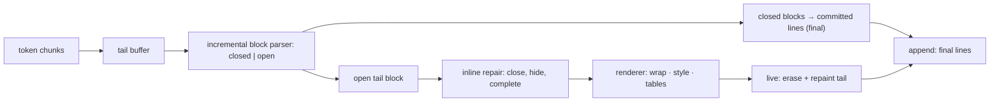

# markdrip

[English](README.md) | [中文](README.zh.md) | [日本語](README.ja.md)

[](LICENSE)   [](CONTRIBUTING.md)

**markdrip 是面向终端的流式 markdown 渲染器，为逐 token 输出而生：在流中途修复不完整的 markdown——未闭合的强调、只打了一半的链接、还没关的代码围栏——并把已完成的块提交为永不重绘的稳定行。零依赖。**


```bash
# not yet on npm — install from a checkout of this repository
npm install && npm run build && npm pack
npm install -g ./markdrip-0.1.0.tgz
```

## 为什么是 markdrip？

每个 AI CLI 都会撞上同一堵墙：模型每次只吐出几个字符的 markdown，而优秀的渲染器——glow、glamour、rich——都是整篇文档渲染器。它们需要完整的文件，于是各工具要么在流结束前一直显示原始的 `**星号**`，要么每来一个 token 就重渲整个缓冲区（闪烁、二次方级重绘、滚动区被毁），要么手搓一个脆弱的"等闭合围栏"状态机。markdrip 就是缺失的中间层：增量块解析器给每个块打上 *closed*（永不再变）或 *open*（仍在增长）标签，closed 块作为最终行恰好提交一次，唯一的 open 尾部则经过一个内联**修复通道**——`**bold` 在闭合符到达前就渲染为粗体，`[label](partial-url` 给标签上样式并隐藏 URL，尚未闭合的围栏照样渲染为代码，*刚刚*敲下的标记会被隐藏而不是原样闪现。引擎的契约由测试强制：任何文档的任何切分方式都与一次性渲染逐字节一致，已提交的行永不变化——因此 append 模式可以放心 `tee` 进日志，而 live 模式在 TTY 上只重绘 open 尾部。

|  | markdrip | glow | glamour | rich (Python) | marked-terminal |
|---|---|---|---|---|---|
| 输入模型 | 增量分块，任意切分 | 整篇文档 | 整篇文档 | 整篇文档 | 整篇文档 |
| 不完整 markdown | 流中途修复，EOF 时定稿 | 不支持 | 不支持 | 不支持 | 不支持 |
| 稳定的部分输出 | closed 块提交一次，永不重绘 | 不支持 | 不支持 | 不支持 | 不支持 |
| 流式代码围栏 | 开着时逐行提交 | 不支持 | 不支持 | 不支持 | 不支持 |
| 运行时依赖 | 0 | Go 模块树 | Go 模块树 | Python 包树 | 4 个直接 + 传递依赖 |
| 管道安全 | append 模式：纯文本，仅最终行 | ANSI 分页 UI | 库 | 库 | 库 |

<sub>能力与依赖声明均对照各项目公开仓库核对，2026-07。</sub>

## 特性

- **逐 token 输入，任意切分** — 喂单个字符或整篇文档都行；最终输出逐字节一致（跨多组样例做了性质测试）。
- **流中途修复** — 未闭合的 `**`/`*`/`~~`/`` ` `` 以推测方式渲染出样式，待定链接给标签上样式并抑制原始 URL，刚敲下的标记被隐藏所以什么都不会闪现；`end()` 用严格的 CommonMark 字面语义为悬挂符号定稿。
- **提交/易变契约** — 完成的块作为稳定行恰好输出一次（对管道、`tee`、滚动区都安全）；只有唯一的 open 尾部块会重绘。
- **代码围栏逐行流式** — 每个带换行的代码行立即提交，长的流式代码块只重绘一个未完的行，而不是整个块。
- **真实的块覆盖** — ATX + setext 标题、带硬换行的段落、嵌套与任务列表、支持懒继续的块引用、反引号/波浪线围栏、带对齐的管道表格、分隔线。
- **终端级排版** — 感知宽度的折行（CJK/emoji/字素宽度）、悬挂缩进、对齐表格；每个带样式的片段自开自闭 SGR，行被切割或重排也不坏。
- **零依赖，完全离线** — 只需要 Node.js；`typescript` 是唯一的 devDependency；无网络、无遥测。

## 快速上手

安装：

```bash
# not yet on npm — install from a checkout of this repository
npm install && npm run build && npm pack
npm install -g ./markdrip-0.1.0.tgz
```

把任何产出 markdown 的命令用管道接进来——输出边到达边排版：

```bash
printf '# Deploy report\n\nAll **12 checks** passed in `4.2s` — see [the log](https://example.test/log).\n\n- [x] build\n- [ ] publish\n' | markdrip --width 60
```

输出（真实捕获的运行结果；加 `--color` 可看到 TTY 上的样式）：

```text
# Deploy report

All 12 checks passed in 4.2s — see the log.

✔ build
☐ publish
```

API 是同一个引擎——chunk 到达就 `push()`，已提交的行永不变化：

```js
import { StreamRenderer, render } from "markdrip";

const r = new StreamRenderer({ width: 72, mode: "append" });
for await (const token of modelStream) {
  process.stdout.write(r.push(token)); // only newly-final lines
}
process.stdout.write(r.end());         // finalize the open tail

render("# one-shot\n\nFor complete documents.\n"); // classic mode
```

## CLI 参考

| 命令 | 作用 | 关键选项 |
|---|---|---|
| `markdrip` | 边流式边渲染 stdin | `--live`、`--plain`、`--width` |
| `markdrip <file>` | 一次性渲染文件 | `--width`、`--no-color` |
| `markdrip -` | 显式读取 stdin | 与 stdin 模式相同 |

在 TTY 上 open 尾部就地重绘（`--live`）；经过管道时只写出已提交的行（`--plain`），所以 `markdrip | tee log` 能留下干净的记录。退出码：0 成功，1 输入文件不可读，2 用法错误。尊重 `NO_COLOR`。

## 选项

| 键 | 默认值 | 效果 |
|---|---|---|
| `width` | `80`（CLI 在 TTY 上取终端宽度，上限 100） | 正文折行列宽；代码行永不折行 |
| `color` | TTY 开，管道关 | 输出 ANSI 样式 |
| `mode` | `append`（API），CLI 自动 | `append`：仅已提交行 · `live`：重绘尾部 |
| `hyperlinks` | `false` | 用 OSC 8 转义包裹链接标签 |
| `showUrls` | `false` | 在每个链接后追加变暗的目标地址 |
| `theme` | 内置 | 覆盖任意 SGR 角色（标题、代码栏、列表符……） |

完整的提交规则、修复策略表和四条被强制的不变量见 [docs/streaming-model.md](docs/streaming-model.md)；底层 API（`parseBlocks`、`parseInline`、`repairInline`、`wrapSpans`）均已导出，并在生成的类型声明中有文档。

## 架构



## 路线图

- [x] 带 closed/open 契约的增量块解析器、内联修复通道、带就地重绘的提交/易变流式引擎、完整块覆盖（标题、列表、引用、围栏、表格、分隔线）、感知宽度折行、CLI — 90 个测试 + `scripts/smoke.sh`（v0.1.0）
- [ ] 围栏内语法高亮（可插拔，默认仍零依赖）
- [ ] 缩进代码块与 HTML 块透传
- [ ] live 模式下终端尺寸变化时重新协商宽度
- [ ] 感知流式的表格布局（渐进式列宽）

完整列表见 [open issues](https://github.com/JaydenCJ/markdrip/issues)。

## 参与贡献

欢迎贡献。用 `npm install && npm run build` 构建，然后运行 `npm test`（90 个测试）和 `bash scripts/smoke.sh`（必须打印 `SMOKE OK`）——本仓库不带 CI，上面的每条声明都由本地运行验证。参见 [CONTRIBUTING.md](CONTRIBUTING.md)，认领一个 [good first issue](https://github.com/JaydenCJ/markdrip/issues?q=is%3Aissue+is%3Aopen+label%3A%22good+first+issue%22)，或发起一场 [discussion](https://github.com/JaydenCJ/markdrip/discussions)。

## 许可证

[MIT](LICENSE)
